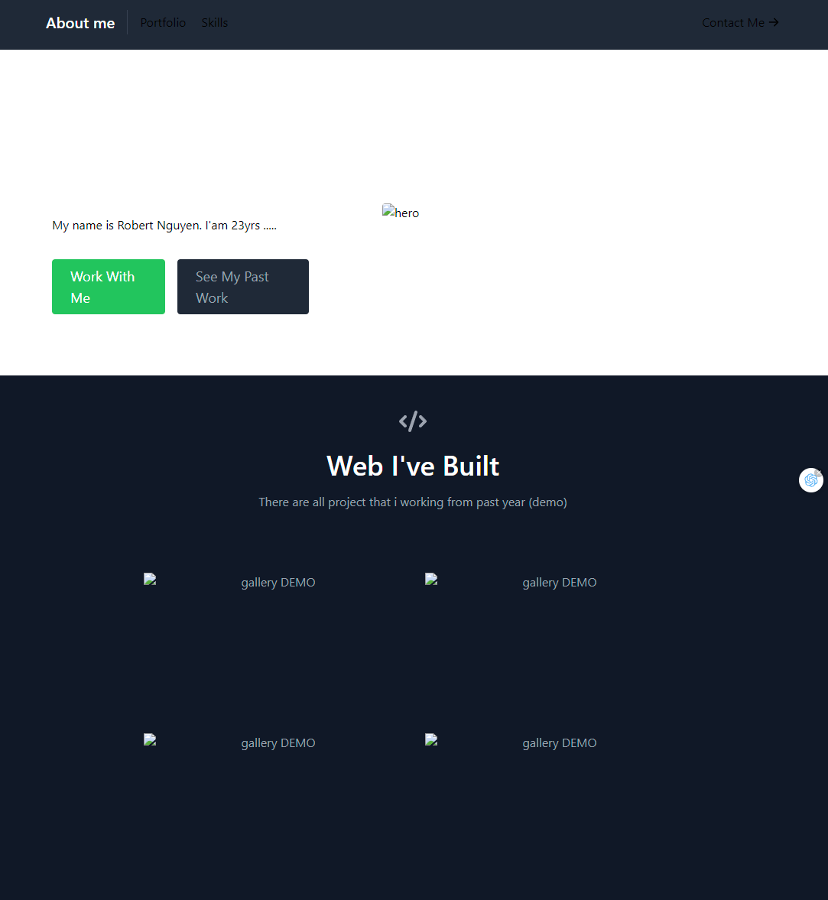

# Portfolio README

Welcome to my portfolio! This repository showcases my work, projects, and skills as a [Your Name or Profession].

## Table of Contents

- [About Me](#about-me)
- [Portfolio](#projects)
- [Skills](#skills)
- [Contact](#contact)

## About Me

## Projects
_Web I've Built

### Project 1: [Project Name]

- **Description:** Demo
- **Technologies Used:** Demo
- **Link:** Demo
- **Code:** Demo

### Project 2: [Project Name]

- **Description:** Demo
- **Technologies Used:**Demo
- **Link:**Demo
- **Code:**Demo

### Project 3: [Project Name]

- **Description:** Demo
- **Technologies Used:**Demo
- **Link:**Demo
- **Code:**Demo

### Project 4: [Project Name]

- **Description:** Demo
- **Technologies Used:**Demo
- **Link:**Demo
- **Code:**Demo

## Skills
_Skill that i learn
- **JavaScript** 
- **Html** .
- **SQL** 
- **React**
- **Node** .
- **Css** .

## Contact
_Please contact me if you have question
--Name
--Email
--Message
--Submit

http://localhost:3000/